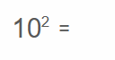
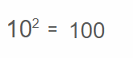

# Showing aritmetic expression of powering with result
## HTML and CSS allow showing on a view port on Browser arithmetic expression of powering like

## Pressing on the equlity symbol should show the result like on the picture

